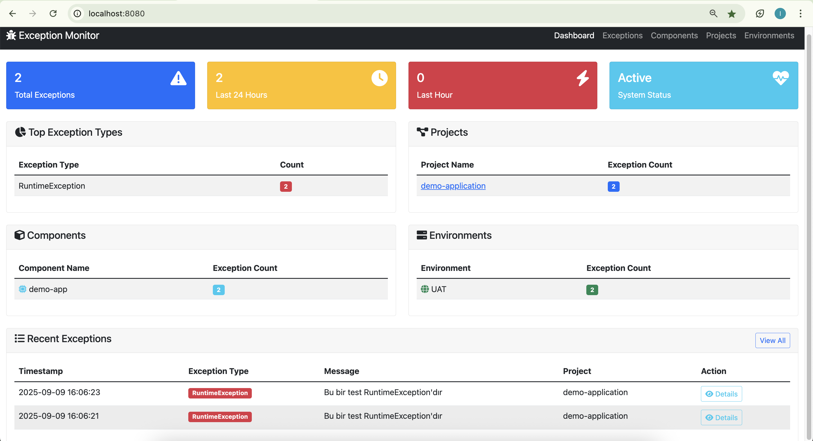

# 🚀 Spring Boot Exception Handling System

A comprehensive exception handling and monitoring system for Spring Boot applications. The system consists of three main components working together to provide robust error tracking and analysis capabilities.



## 📋 Table of Contents

- [System Components](#-system-components)
- [Quick Start](#-quick-start)
- [Features](#-features)
- [Monitoring Interface](#-monitoring-interface)
- [Configuration](#-configuration)
- [API Endpoints](#-api-endpoints)
- [Library Usage](#-library-usage)
- [Development](#-development)

## 🏗️ System Components

### 1. Exception Handler Library
- **Purpose**: Reusable library for Spring Boot applications
- **Features**: Captures exceptions, sends to Kafka, writes logs
- **Integration**: Auto-configuration support with Spring Boot
- **HTTP Headers**: Automatically captures HTTP request information

### 2. Exception Monitor Microservice
- **Purpose**: Central monitoring and analysis service
- **Features**: Consumes Kafka messages, stores in database
- **Interface**: Web-based monitoring dashboard
- **Database**: H2 in-memory (development) / PostgreSQL (production)

### 3. Demo Application
- **Purpose**: Example implementation showing library usage
- **Features**: Various exception types for testing
- **Port**: 8092 (configurable)
- **Endpoints**: Multiple test scenarios available

## 🚀 Quick Start

### Prerequisites
- ☕ Java 17+
- 🛠️ Gradle 7+
- 📡 Apache Kafka (localhost:9092)
- 🐳 Docker Compose (optional)

### Option 1: Docker Compose (Recommended)
```bash
# Start Kafka and Zookeeper
docker-compose up -d

# Build and run services with your IDE or command line
```

### Option 2: Manual Setup

1. **Build the Library**
```bash
./gradlew :exception-handler-library:publishToMavenLocal
```

2. **Start Exception Monitor**
```bash
./gradlew :exception-monitor:bootRun
```
🌐 Web Interface: http://localhost:8080

3. **Start Demo Application**
```bash
./gradlew :demo-app:bootRun
```
🔗 API: http://localhost:8092

## ✨ Features

- ✅ **Automatic HTTP Header Capture**: Captures request headers, parameters, and remote connection info
- ✅ **Component-Based Tracking**: Track exceptions by project, component, pod, and environment
- ✅ **Real-time Monitoring**: Live dashboard with statistics and filtering
- ✅ **Multi-Environment Support**: UAT, INT, PROD environment configurations
- ✅ **Request Parameter Tracking**: Automatically captures URL parameters
- ✅ **Security**: Sensitive headers (Authorization) are automatically masked
- ✅ **Responsive Design**: Modern Bootstrap 5 UI works on all devices
- ✅ **Detailed Exception View**: Stack traces, system info, and HTTP context

## 🖥️ Monitoring Interface

The Exception Monitor provides comprehensive web-based monitoring with multiple specialized views:

### Dashboard Overview

- **Real-time Statistics**: Total exceptions, 24h trends, hourly counts
- **Quick Navigation**: Access to all major sections
- **Recent Activity**: Latest exceptions with direct access to details

### Exception Management

- **Advanced Filtering**: Filter by project, type, date range
- **Pagination**: Handle large exception datasets efficiently
- **Exception Details**: Click-through to detailed exception analysis

### Component Analysis

- **Component Statistics**: Exception counts by application component
- **Pod Information**: Detailed pod-level exception tracking
- **Performance Insights**: Identify problematic components quickly

### Project Management

- **Project Overview**: Exception counts across all projects
- **Environment Breakdown**: Projects grouped by deployment environment
- **Quick Actions**: Direct links to project-specific exception lists

### Environment Monitoring

- **Environment Health**: Visual cards showing exception counts per environment
- **Component Distribution**: See which components are active in each environment
- **Progress Indicators**: Visual representation of component exception ratios

### Navigation Features
- **Consistent Navigation**: All pages include the same navigation menu
- **Active Page Indicators**: Always know which section you're viewing
- **Quick Access**: Jump between Dashboard, Exceptions, Components, Projects, and Environments

### Monitoring URLs
- 🏠 **Dashboard**: http://localhost:8080
- 📋 **Exceptions**: http://localhost:8080/exceptions  
- 🧩 **Components**: http://localhost:8080/components
- 📁 **Projects**: http://localhost:8080/projects
- 🌍 **Environments**: http://localhost:8080/environments
- 🗄️ **H2 Console**: http://localhost:8080/h2-console (dev only)

## ⚙️ Configuration

### Demo Application Configuration (`application.yml`)
```yaml
server:
  port: 8092

spring:
  application:
    name: demo-app
    version: 1.2.0

exception:
  handler:
    project-name: demo-application
    component-name: demo-app
    pod-name: demo-pod-001
    pod-ip: 192.168.1.100
    cluster-name: development-cluster
    environment: UAT
    kafka:
      topic: exceptions
      bootstrap-servers: localhost:9092
```

### Environment Variables Support
All configuration values support environment variable overrides:
```bash
export PROJECT_NAME=my-production-app
export ENVIRONMENT=PROD
export KAFKA_BOOTSTRAP_SERVERS=prod-kafka:9092
```

## 🔗 API Endpoints

### Demo Application Test Endpoints

#### 1. Basic Exception Test
```bash
curl "http://localhost:8092/api/throw-exception?type=runtime"
```

#### 2. Exception with HTTP Headers (Recommended)
```bash
curl --location 'http://localhost:8092/api/throw-exception-with-headers?type=runtime&debug=true' \
     --header 'X-Custom-Header: TestValue' \
     --header 'Accept: application/json' \
     --header 'Authorization: Bearer token123'
```

#### 3. Validation Error Test
```bash
curl "http://localhost:8092/api/validation-error?email=invalid-email"
```

#### 4. Database Error Simulation
```bash
curl "http://localhost:8092/api/database-error"
```

#### 5. User Processing Error
```bash
curl -X POST "http://localhost:8092/api/user/999" \
     -H "Content-Type: application/json" \
     -d '{"name": "Test User", "email": "test@example.com"}'
```

#### 6. Configuration Check
```bash
curl "http://localhost:8092/api/config"
```

### What Gets Captured
- ✅ **Exception Details**: Type, message, full stack trace
- ✅ **HTTP Information**: Method, URL, headers, parameters
- ✅ **System Context**: Project, component, pod, cluster, environment
- ✅ **Request Data**: Remote address, user agent, session ID
- ✅ **Custom Data**: Any additional data you provide
- ✅ **Security**: Sensitive headers automatically masked

## 📚 Library Usage

### 1. Add Dependency
```gradle
dependencies {
    implementation "com.example:exception-handler-library:1.0.0"
}
```

### 2. Configure Your Application
```yaml
exception:
  handler:
    project-name: ${PROJECT_NAME:my-application}
    component-name: ${COMPONENT_NAME:my-component}
    pod-name: ${POD_NAME:my-pod-001}
    pod-ip: ${POD_IP:192.168.1.10}
    cluster-name: ${CLUSTER_NAME:production}
    environment: ${ENVIRONMENT:PROD}
    kafka:
      topic: exceptions
      bootstrap-servers: ${KAFKA_BOOTSTRAP_SERVERS:localhost:9092}
```

### 3. Use in Your Code
```java
@RestController
public class MyController {
    
    @Autowired
    private ExceptionHandler exceptionHandler;
    
    @GetMapping("/api/my-endpoint")
    public ResponseEntity<String> myEndpoint(@RequestParam String param) {
        try {
            // Your business logic here
            return ResponseEntity.ok("Success");
        } catch (Exception e) {
            // Option 1: Basic exception handling
            exceptionHandler.handle(e);
            
            // Option 2: With additional data
            Map<String, Object> additionalData = new HashMap<>();
            additionalData.put("param", param);
            additionalData.put("operation", "my-endpoint");
            exceptionHandler.handle(e, additionalData);
            
            // Option 3: With HTTP headers (recommended)
            exceptionHandler.handleWithHttpHeaders(e);
            
            // Option 4: With HTTP headers + additional data
            exceptionHandler.handleWithHttpHeaders(e, additionalData);
            
            return ResponseEntity.internalServerError()
                .body("Error occurred and logged to monitoring system");
        }
    }
}
```

### Method Options

| Method | Description | HTTP Headers | Custom Data |
|--------|-------------|--------------|-------------|
| `handle(exception)` | Basic exception handling | ❌ | ❌ |
| `handle(exception, data)` | With custom data | ❌ | ✅ |
| `handleWithHttpHeaders(exception)` | Auto-captures HTTP context | ✅ | ❌ |
| `handleWithHttpHeaders(exception, data)` | HTTP context + custom data | ✅ | ✅ |

## 🛠️ Development

### Project Structure
```
exception-handling-system/
├── exception-handler-library/    # Reusable library
├── exception-monitor/            # Monitoring service
├── demo-app/                    # Example implementation
├── images/                      # Documentation images
├── docker-compose.yml          # Kafka setup
└── README.md                   # This file
```

### Development Setup
1. **Start Kafka**: `docker-compose up -d`
2. **Build Library**: `./gradlew :exception-handler-library:publishToMavenLocal`
3. **IDE Setup**: Import as Gradle project, use Java 17
4. **Database**: H2 in-memory for development (check console at `/h2-console`)

### Production Considerations
- 🗄️ **Database**: Replace H2 with PostgreSQL or MySQL
- 📡 **Kafka**: Use production Kafka cluster
- 🔧 **Logging**: Set log level to INFO or WARN
- 🚀 **Performance**: Configure appropriate JVM settings
- 🔐 **Security**: Review sensitive data masking rules

### Building for Production
```bash
# Build all modules
./gradlew build

# Build specific module
./gradlew :exception-monitor:bootJar
./gradlew :demo-app:bootJar

# Run tests
./gradlew test
```

## 📈 Monitoring Capabilities

### Dashboard Metrics
- **Real-time Counts**: Total, 24-hour, and hourly exception counts
- **Exception Types**: Top exception types with counts
- **Project Statistics**: Exception distribution across projects
- **Component Analysis**: Most problematic components
- **Environment Health**: Exception trends by environment

### Advanced Filtering
- **Date Range**: Filter exceptions by time period
- **Project Filter**: View exceptions for specific projects
- **Exception Type**: Filter by exception class
- **Environment**: Focus on specific deployment environments
- **Component**: Drill down to specific application components

### Export and Integration
- **JSON API**: All data available via REST API
- **Real-time**: Live updates as exceptions occur
- **Historical Data**: Full exception history with search capabilities

---

## 🤝 Contributing

This is a demonstration project showing Spring Boot exception handling patterns. Feel free to use, modify, and extend for your specific needs.

## 📄 License

This project is for educational and demonstration purposes.

---

**Built with ❤️ using Spring Boot, Apache Kafka, and Bootstrap**